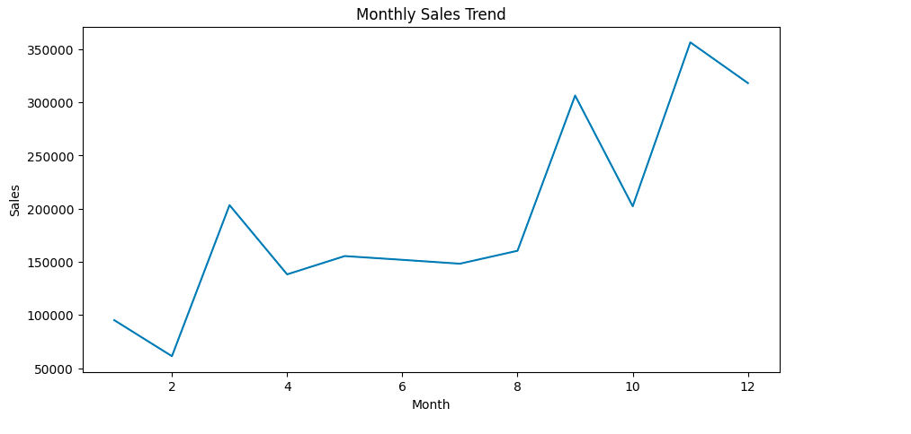
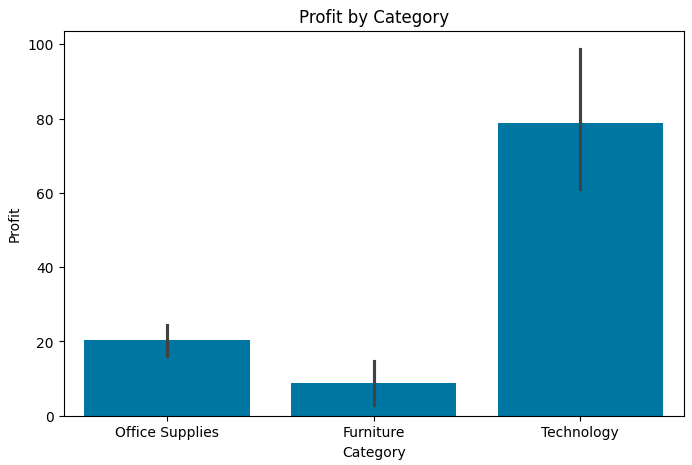
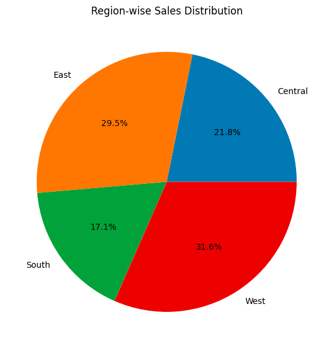
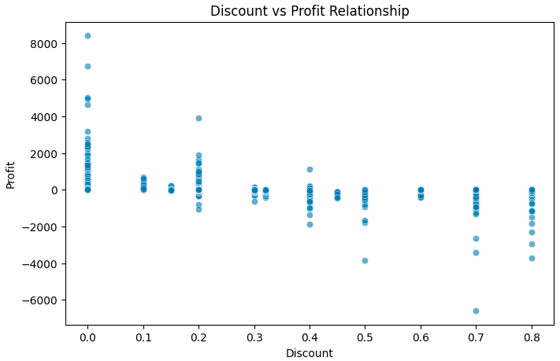
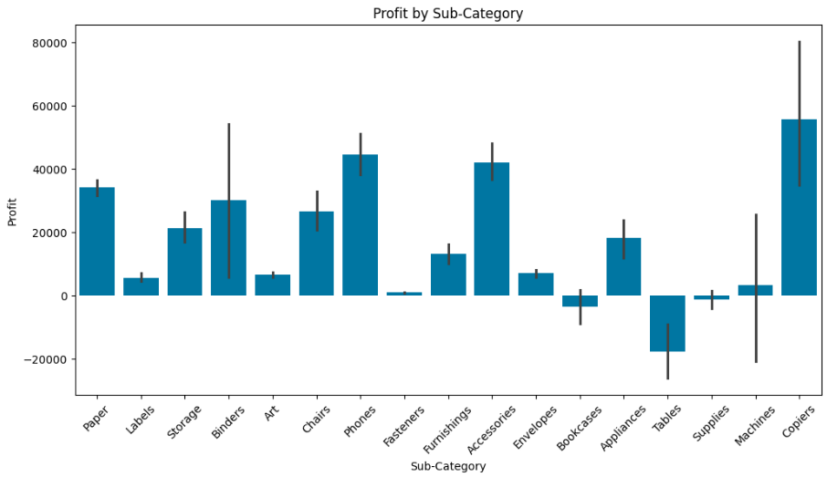

# 📊 Superstore Sales Analysis

## 📌 Overview
Ye project ek **sales dataset** ka analysis karta hai using Python (pandas, matplotlib, seaborn).  
Is analysis ka goal hai business ke sales aur profit trends samajhna, top/bottom products identify karna, aur actionable insights nikalna.

---

## 🛠 Tools Used
- Python
- Pandas
- Matplotlib
- Seaborn
- Jupyter Notebook

---

## 📂 Steps in Analysis
1. CSV load (pandas)
2. Data samajhna (info, head)
3. Data cleaning (date convert, missing check)
4. New columns banana (Month, Year)
5. Basic analysis (sales, profit)
6. GroupBy analysis (category, region)
7. Loss analysis
8. Top/Bottom products
9. Visualization (graphs)
10. Insights likhna

---

## 📊 Visualizations
### Monthly Sales Trend

### Profit by Category

### Region-wise Sales Distribution

### Discount vs Profit Relationship

### Profit by Sub-Category

---

## 💡 Insights
- Total sales aur profit ka overview mila.
- Category wise analysis se pata chala ke kaun si category zyada profitable hai.
- Region wise analysis se strong aur weak regions identify hue.
- Loss analysis se negative profit wale products samajh aaye.
- Top aur bottom products se business strategy improve ki ja sakti hai.
- Discount vs Profit scatter plot se samajh aaya ke zyada discount dene se profit kam ho raha hai.

---

## ▶️ How to Run
1. Repository clone karo ya notebook download karo.
2. Jupyter Notebook open karo.
3. Notebook ke cells step by step run karo.
